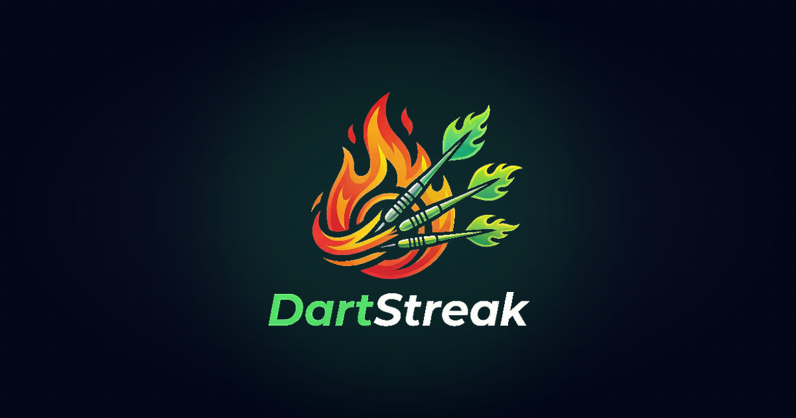

# 🎯 DartStreak



DartStreak is a premium, modern platform for darts enthusiasts. Whether you're playing solo, challenging friends online, or competing in global leagues, DartStreak provides the ultimate tracking and social experience for the modern player.

**Play for free at [dartstreak.pages.dev](https://dartstreak.pages.dev/)**

## ✨ Key Features

- **🎥 Online Multiplayer**: Play against opponents worldwide with real-time video support. Feel like you're in the same room!
- **🏆 Leagues & Tournaments**: Create private leagues or join public tournaments. Track standings and climb the ranks.
- **🎯 Daily Challenges**: Throw 9 darts every day, submit your score, and see where you rank on the global leaderboard.
- **📊 Advanced Analytics**: Detailed statistics and performance graphs to help you track your progress and improve your game.
- **👥 Social Experience**: Invite friends via share links, add them to your friend list, and challenge them to live matches.
- **🌍 Multi-language**: Fully localized in **English** and **Swedish** (Spela på svenska!).
- **📱 PWA Ready**: Install DartStreak on your home screen for a fast, native-app experience on iOS and Android.

## 🚀 Why DartStreak?

- **100% Free**: No hidden costs, no subscriptions, and no in-app purchases.
- **Fair Play**: Designed with a focus on sportsmanship and competitive integrity.
- **Modern Experience**: A sleek, dark-mode first interface built for enthusiasts.

## 🛠️ Tech Stack

DartStreak is built with high-performance, industry-standard technologies:

- **Frontend**: [React](https://reactjs.org/) + [Vite](https://vitejs.dev/)
- **Styling**: [Tailwind CSS](https://tailwindcss.com/) + [shadcn/ui](https://ui.shadcn.com/)
- **Backend/Auth**: [Supabase](https://supabase.com/)
- **State Management**: [TanStack Query](https://tanstack.com/query/latest)
- **Internationalization**: [i18next](https://www.i18next.com/)
- **Visuals**: [Lucide Icons](https://lucide.dev/) + [Recharts](https://recharts.org/)

## 🛠️ Getting Started

### Prerequisites

- Node.js (v18 or higher)
- npm or yarn

### Local Setup

1. **Clone the repository**:
   ```bash
   git clone https://github.com/WilgotM/dartstreak-main.git
   cd dartstreak-main
   ```

2. **Install dependencies**:
   ```bash
   npm install
   ```

3. **Set up Environment Variables**:
   Create a `.env` file in the root directory and add your Supabase credentials:
   ```env
   VITE_SUPABASE_URL=your_supabase_url
   VITE_SUPABASE_ANON_KEY=your_supabase_anon_key
   ```

4. **Start the development server**:
   ```bash
   npm run dev
   ```

---

Built with ❤️ for the Darts Community.
**DartStreak 2026 - Made with fair play.**
